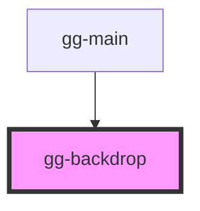

# gg-backdrop

<!-- Auto Generated Below -->

## Properties

| Property | Attribute | Description                         | Type      | Default |
| -------- | --------- | ----------------------------------- | --------- | ------- |
| `open`   | `open`    | A prop to make the backdrop visible | `boolean` | `false` |

## Dependencies

### Used by

 - [gg-main](../../pages/gg-main)

### Graph

----------------------------------------------

*Built with [StencilJS](https://stenciljs.com/)*
