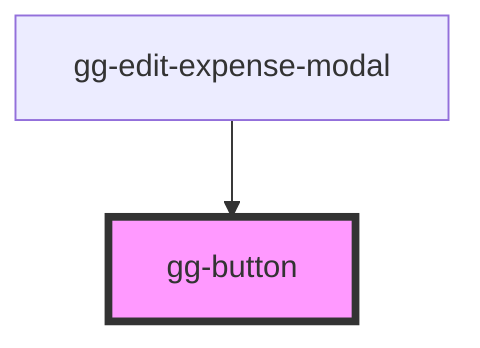

# gg-button

<!-- Auto Generated Below -->

## Properties

| Property    | Attribute   | Description                                       | Type      | Default |
| ----------- | ----------- | ------------------------------------------------- | --------- | ------- |
| `secondary` | `secondary` | A prop that determines it the button is secondary | `boolean` | `false` |

## Dependencies

### Used by

 - [gg-edit-expense-modal](../../molecules/gg-edit-expense-modal)

### Graph

----------------------------------------------

*Built with [StencilJS](https://stenciljs.com/)*
