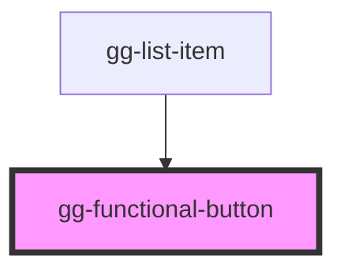

# gg-functional-button

<!-- Auto Generated Below -->

## Dependencies

### Used by

 - [gg-list-item](../../molecules/gg-list-item)

### Graph

----------------------------------------------

*Built with [StencilJS](https://stenciljs.com/)*
