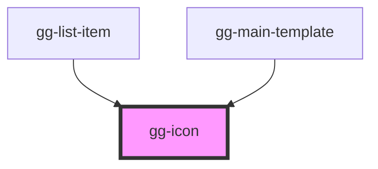

# gg-icon

<!-- Auto Generated Below -->

## Properties

| Property | Attribute | Description      | Type     | Default     |
| -------- | --------- | ---------------- | -------- | ----------- |
| `name`   | `name`    | Name of the icon | `string` | `undefined` |

## Dependencies

### Used by

 - [gg-list-item](../../molecules/gg-list-item)
 - [gg-main-template](../../templates/gg-main-template)

### Graph

----------------------------------------------

*Built with [StencilJS](https://stenciljs.com/)*
