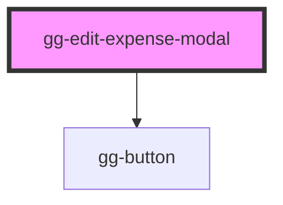

# gg-edit-expense-modal

<!-- Auto Generated Below -->

## Properties

| Property      | Attribute | Description                                                                                  | Type                                                                     | Default     |
| ------------- | --------- | -------------------------------------------------------------------------------------------- | ------------------------------------------------------------------------ | ----------- |
| `expenseData` | --        | The initial data for the expense to edit. This should be provided from the parent component. | `{ amount: number; description: string; date: string; }`                 | `undefined` |
| `saveExpense` | --        | The function to save the edited expense. This should be provided from the parent component.  | `(data: { amount: number; description: string; date: string; }) => void` | `undefined` |

## Dependencies

### Depends on

- [gg-button](../../atoms/gg-button)

### Graph

----------------------------------------------

*Built with [StencilJS](https://stenciljs.com/)*
