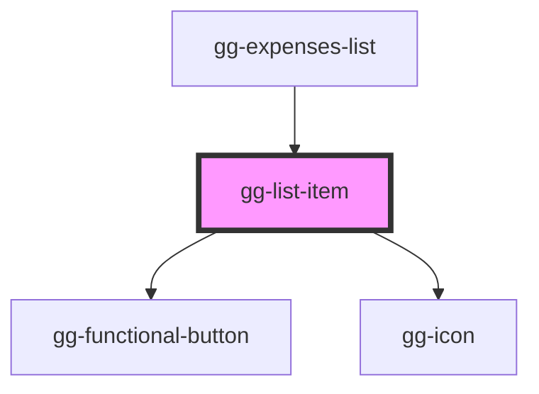

# gg-list-item

<!-- Auto Generated Below -->

## Properties

| Property      | Attribute     | Description                                     | Type                     | Default     |
| ------------- | ------------- | ----------------------------------------------- | ------------------------ | ----------- |
| `amount`      | `amount`      | The expense amount                              | `string`                 | `undefined` |
| `date`        | `date`        | The date when expense is made                   | `string`                 | `undefined` |
| `description` | `description` | Description                                     | `string`                 | `undefined` |
| `onDelete`    | --            | The function that is tirggered by delete button | `(event: Event) => void` | `undefined` |
| `onEdit`      | --            | The function that is tirggered by edit button   | `(event: Event) => void` | `undefined` |

## Dependencies

### Used by

 - [gg-expenses-list](../../organisms/gg-expenses-list)

### Depends on

- [gg-functional-button](../../atoms/gg-functional-button)
- [gg-icon](../../atoms/gg-icon)

### Graph

----------------------------------------------

*Built with [StencilJS](https://stenciljs.com/)*
