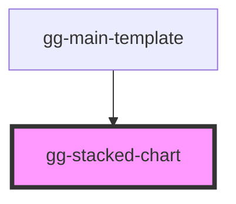

# gg-stacked-chart

<!-- Auto Generated Below -->

## Properties

| Property   | Attribute | Description               | Type                                                 | Default |
| ---------- | --------- | ------------------------- | ---------------------------------------------------- | ------- |
| `expenses` | --        | Expenses grouped by month | `{ month: string; amount: number; year: number; }[]` | `[]`    |

## Dependencies

### Used by

 - [gg-main-template](../../templates/gg-main-template)

### Graph

----------------------------------------------

*Built with [StencilJS](https://stenciljs.com/)*
