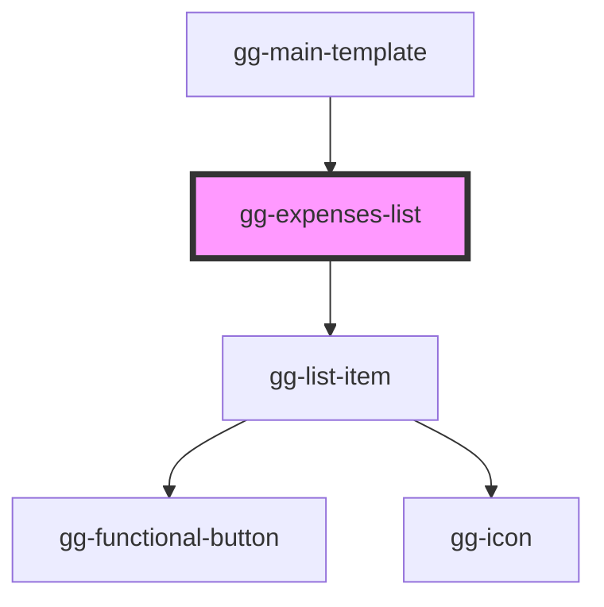

# gg-expenses-list

<!-- Auto Generated Below -->

## Properties

| Property   | Attribute | Description                         | Type                             | Default     |
| ---------- | --------- | ----------------------------------- | -------------------------------- | ----------- |
| `expenses` | --        | List of expenses                    | `ExpenseData[]`                  | `[]`        |
| `onDelete` | --        | An action when deleting the expense | `(expsenseID: string) => void`   | `undefined` |
| `onEdit`   | --        | An action when editing the expense  | `(expense: ExpenseData) => void` | `undefined` |

## Dependencies

### Used by

 - [gg-main-template](../../templates/gg-main-template)

### Depends on

- [gg-list-item](../../molecules/gg-list-item)

### Graph

----------------------------------------------

*Built with [StencilJS](https://stenciljs.com/)*
