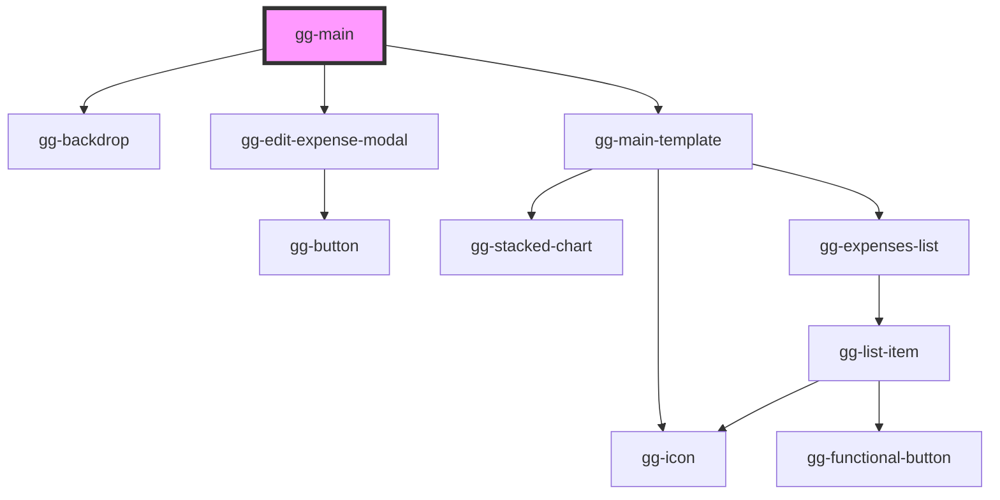

# gg-main

<!-- Auto Generated Below -->

## Dependencies

### Depends on

- [gg-backdrop](../../atoms/gg-backdrop)
- [gg-edit-expense-modal](../../molecules/gg-edit-expense-modal)
- [gg-main-template](../../templates/gg-main-template)

### Graph

----------------------------------------------

*Built with [StencilJS](https://stenciljs.com/)*
