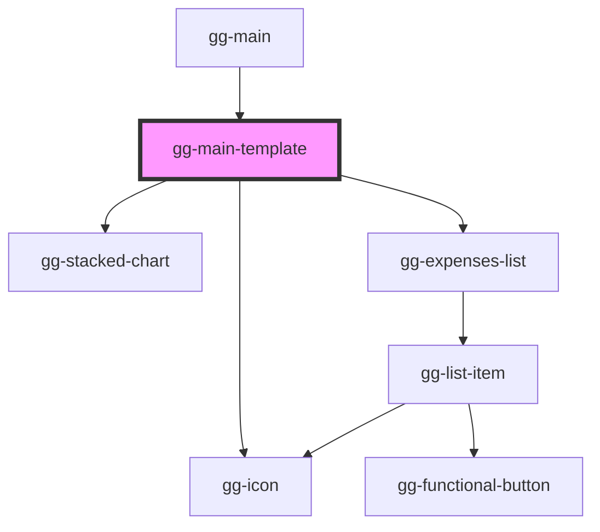

# gg-main-template

<!-- Auto Generated Below -->

## Properties

| Property         | Attribute      | Description                           | Type                             | Default     |
| ---------------- | -------------- | ------------------------------------- | -------------------------------- | ----------- |
| `data`           | --             | Expenses data                         | `ExpenseData[]`                  | `[]`        |
| `isDarkMode`     | `is-dark-mode` | The theme                             | `boolean`                        | `false`     |
| `onCreate`       | --             | An cction when creating a new expense | `(expense: ExpenseData) => void` | `undefined` |
| `onDelete`       | --             | An action when deleting the expense   | `(expsenseID: string) => void`   | `undefined` |
| `onEdit`         | --             | An action when editing the expense    | `(expense: ExpenseData) => void` | `undefined` |
| `switchDarkMode` | --             | Swtiches between dark and light mode  | `() => void`                     | `undefined` |

## Dependencies

### Used by

 - [gg-main](../../pages/gg-main)

### Depends on

- [gg-icon](../../atoms/gg-icon)
- [gg-stacked-chart](../../molecules/gg-stacked-chart)
- [gg-expenses-list](../../organisms/gg-expenses-list)

### Graph

----------------------------------------------

*Built with [StencilJS](https://stenciljs.com/)*
