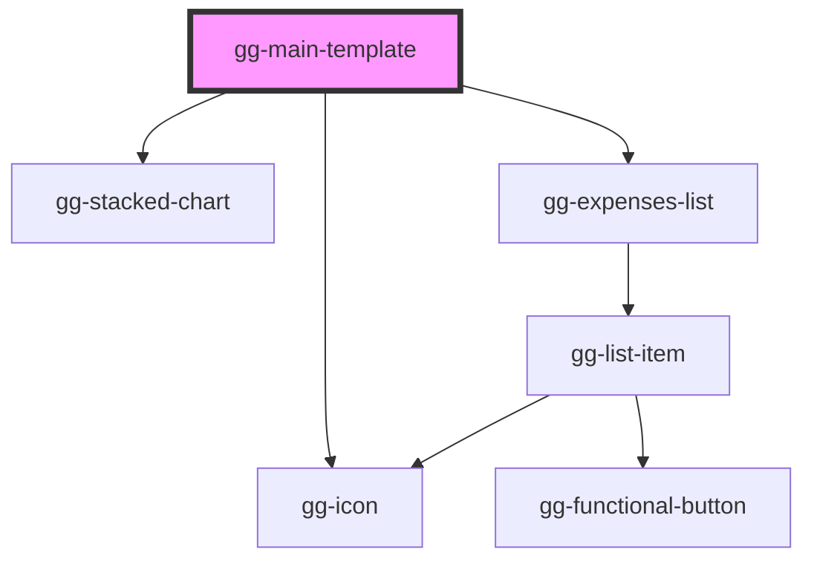

# gg-main-template

<!-- Auto Generated Below -->

## Properties

| Property   | Attribute | Description                           | Type                             | Default     |
| ---------- | --------- | ------------------------------------- | -------------------------------- | ----------- |
| `data`     | --        | Expenses data                         | `ExpenseData[]`                  | `[]`        |
| `onCreate` | --        | An cction when creating a new expense | `(expense: ExpenseData) => void` | `undefined` |
| `onDelete` | --        | An action when deleting the expense   | `(expsenseID: string) => void`   | `undefined` |
| `onEdit`   | --        | An action when editing the expense    | `(expense: ExpenseData) => void` | `undefined` |

## Dependencies

### Depends on

- [gg-icon](../../atoms/gg-icon)
- [gg-stacked-chart](../../molecules/gg-stacked-chart)
- [gg-expenses-list](../../organisms/gg-expenses-list)

### Graph

----------------------------------------------

*Built with [StencilJS](https://stenciljs.com/)*
